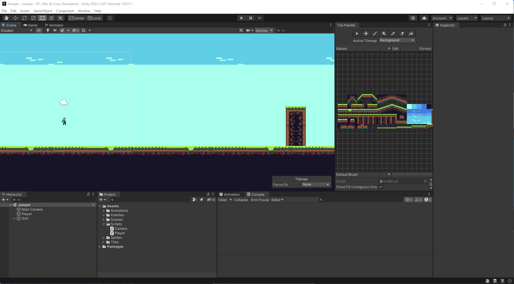

# Jumper

Tilemaps and Player movement via Unity 2D Physics

> You realize the thing you thought was good actually isn't. You realize why and you improve on it. And that's just an endless cycle. - Eric Barone creator of Stardev Valley

## Backlog

- Player health bar
- Player good vibes bar
- Player takes dmg from Enemy
- Good vibes thought
- Player collect good vibe thoughts
- Cut Scene
- Level 2
- Scene transition from level 1 to level 2
- [Bug] Tearing in the Scene randomly

## Completed

- Design Level 1 with using Tilemaps (Sky, Ground, Platforms)
- Player sprite
- Player animation
- Player collision with Platforms and Jumping
- 2D Physics: moveSpeed, jumpForce
- Camera follows player
- Clamping moveSpeed
- Bug fix: smooth movement over tilemaps via Composite Collider 2D
- Projectiles shooting from Player (hint: left-click)
- Enemies now have health bars and take damage from projectiles
- More visible bullet
